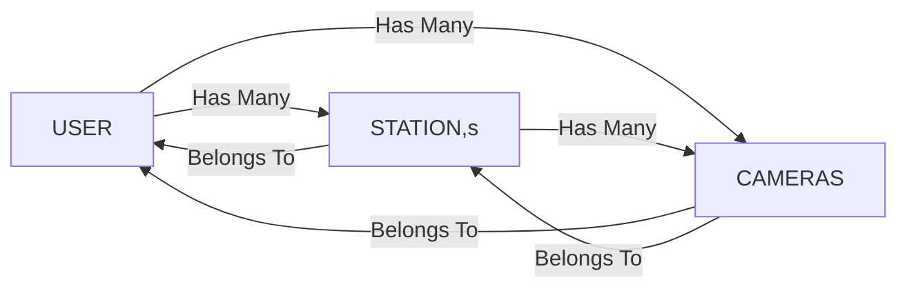

# The Alarm System
Sending response as a state of true or false alarm on the basis of feed sent by the data sources. Since it is a mock implementation the response is sent by using a random function. It is designed to deal with two kind of data sources. **Monitory Systems** and **Camera Stations**

### Prerequisites

    docker
    docker-compose

Please visit [https://docs.docker.com/get-docker/](https://docs.docker.com/get-docker/) for the installation

### Installing

    docker-compose up
    
    # or for running it in the background
    
    docker-compose up -d
    
    
   This will take 15 to 20 minutes for  setting up the project. After the installation open these links in separate tabs.
   [http://localhost:8080/](http://localhost:8080/) - Sending feeds
   [http://localhost:9000/](http://localhost:9000/) - Viewing feeds

## Built With

 - [Yarn](https://yarnpkg.com/) - Package manager.
 - [Express](https://expressjs.com/)  - Robust Framework for Nodejs.
 - [Sequelize](https://sequelize.org/) - Promise-based Node.js ORM.
 - [Sqlite](https://www.sqlite.org/index.html) - small, fast, self-contained, high-reliability, full-featured, SQL database engine.
 - [Socket IO](https://socket.io/) - For live communication.
 - [Vue js](https://vuejs.org/) - Frontend Framework.
 - [Vue Cli](https://cli.vuejs.org/) - For ruining and configuring vue js app. 
 - [Vuex](https://vuex.vuejs.org/) - For state management,
 - [Jest](https://jestjs.io/) - Unit testing.
 - [Prettier](https://prettier.io/) /  [Eslint](https://eslint.org/)  - Code Formatting, JS and TS linting
 - [Stylelint](https://stylelint.io/) - SASS linting.
 - [Webpack](https://webpack.js.org/) - Bundling files.
 - [Typescript](https://www.typescriptlang.org/) - For client app
 - [Docker](https://www.docker.com/) - For easy building.

## Assumptions
There are two companies(data sources) registered with us already as follows.
 - Calipsa
 - 1 branch store

**CALIPSA**
This company uses basic HTTP API call for communicating with server. It has two camera stations. **UK Camera station** and **US Camera Station**. Both stations have two cameras each so the feed payload from their cameras looks like 

    { id, companyId, companyName, stationId, message }

The authentication scheme they uses is web based token system which means after sending the correct credentials  they will get the JWT signed token which would be necessary for getting the feed response later.

**1 branch store**
This company uses Web Socket for communicating with server. It has four cameras at a single station so the feed payload from their cameras looks like 

    { id, companyId, companyName, message }

> *Note: stationId has been removed*

The authentication scheme they uses is basic username / password which means for every request they will need to send their credentials for getting the response. 

## Architecture Overview
The Application is divided in three sub apps.

 - API - Nodejs server for creating API's and using socket io.
 - Admin - A very light weight Vue js app for showing the list of feeds served by Nodejs.
 - Data Source - Client app acting as the data source based on Vue js.

Let's have a detail look into the source code of above.
 
## API

**Routes** - There are three type of routes. `Admin Routes` - for Admin dashboard  `Public Routes` - for Auth  and `Private Routes` for feed analyzing. These are defined in `config/routes.js`and are mapped with the controllers defined in `src/controllers`.
**Logs** - Combining `winston` and `morgan` for creating the stream of logs into the logs folder with `app.log` and `error.log` . Queries and API's request , response continuously gets saved there which helps a lot for debugging.
**Socket IO** - For live communication between server and socket based clients. Configurations and events handling can be found in `config/socket.js`. 
**CORS** - For Allowing Cross-Origin resource sharing.
**Middleware** - `jwtAuth` defined in `config/auth.js` for validating the token from every incoming requests instead of doing it in every controller function. This middleware only filters the private routes.
**Helmet** - For erasing any server info from the response headers. This helps in increasing security.
**Models** - The `src/models` folder contains all the database table models and structure.
**Migrations** - The `src/models` folder contains all the migrations required for creating the database schema.
**Seeders** -   The `src/models` folder contains all the seeders required for inserting the assumed data.
 **Utils** -  The `src`  folder has the util file which contains functions that are likely to be used in overall app like logging sorting or some calculations. Also used for the prototyping.
 **Assosiations** -  The assosiations for the table models are defined as.

## Admin
It is a vuejs application located at `api/admin` folder. It's purpose is to show the feeds as they come into system. For the socket based feeds (from 1 branch store) you don't have to refresh the page but for others feeds you will have to refresh the browser.

## Data Source

**Components** - Here is the list of components used for front end.
 1. Navbar - Showing bar at the top
 2. Content - Properly formatting the page content
 3. CameraCard - For showing camera details.
 4. Companies - For showing all the assumed companies,
 5. Feed - Cameras are shown on the basis of stations ( if any).
 6. Error - For 500 internal server errors
 7. NotFound - For 404 erros.
 
**Styles** - `/src/styles/_variables.scss` and `/src/styles/_mixins.scss` are automatically injected to every components so they are accessible everywhere using css loaderOptions. `/src/styles/_app.scss` is being used for the global styling.
**Tests** - A basic unit test is provided with every component as `*.spec.ts` . Jest configurations can be found in `jest.config .js`.
**Interceptors** - For adding jwt token to every request automatically if token exists in store. Global error handling for 404 , 401 and 500 and routing to appropriate component.
**login.config** - The file is located into root and contain the login information for assumed companies. Change the credentials in this file to see the 401 handling.
> Note: This file is copied separately in docker so you don't need to rebuild the image after changing this file.
